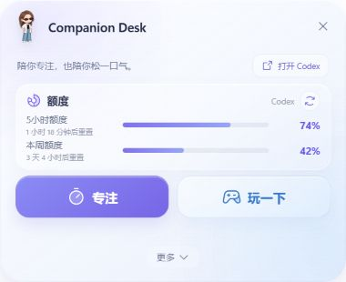
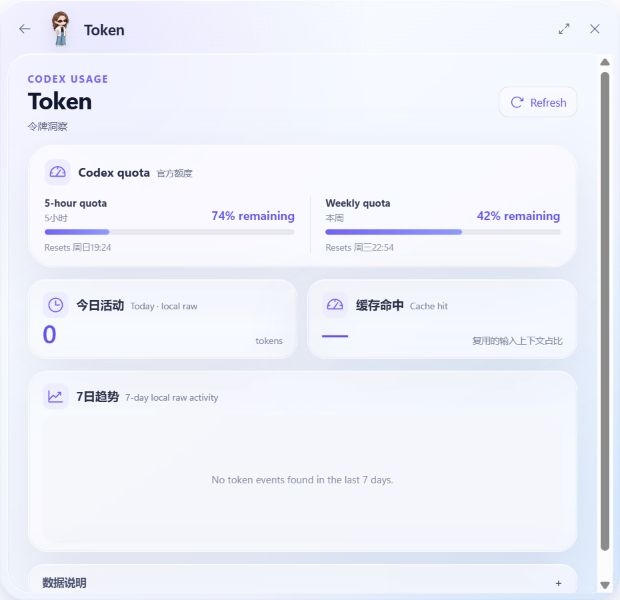

# Companion Desk

A small, local-first Windows companion for Codex quota checks, focused work,
short game breaks, and quick access to Windows OpenSSH. Companion Desk is the
product; **Kunkun is the pet** that lives on the desktop.

Companion Desk is an independent community project and is not affiliated with
or endorsed by OpenAI.



## Public beta

`v0.5.0-beta` targets Windows 10/11 x64. It is intentionally local-first:

- floating Kunkun pet with a compact glass desk;
- local Codex 5-hour and weekly quota display;
- a separate local activity view;
- focus timer with a completion note;
- local Gomoku and 2048;
- embedded Windows OpenSSH using the user's own SSH config alias.

**Friend networking is not included in this beta.** Firebase is disabled in the
public interface. Using the shipped beta does not require a Firebase project or configuration.



## Download and verify

When published, the `v0.5.0-beta` GitHub Release is intended to contain exactly
these Windows assets:

- unsigned NSIS **EXE** installer — primary choice;
- unsigned **MSI** installer — backup for environments that prefer MSI;
- `SHA256SUMS.txt` — SHA-256 checksums for both installers.

The installers are not code-signed. Windows SmartScreen may show “Unknown
publisher”. Download only from this repository's GitHub Release, then compare
the installer hash with `SHA256SUMS.txt` before running it:

```powershell
Get-FileHash .\Companion-Desk_0.5.0-beta_windows-x64-setup.exe -Algorithm SHA256
```

Do not bypass a warning when the filename or hash does not match the release.
Clean-machine acceptance remains a release gate and must not be claimed until
the exact candidate has recorded evidence.

## Data and feature boundaries

### Codex quota

Quota is read using Codex login state already available to the same Windows
account. Support depends on non-public response formats that can change. If a
trustworthy value is unavailable, Companion Desk shows unavailable or stale
data; it never substitutes an estimate derived from local history.

The local activity view reads Codex session records present on this computer.
It is useful for trends but is not an authoritative billing or quota record.

### HPC / SSH

The HPC page is an embedded Windows OpenSSH terminal, not a cluster scheduler
or remote monitoring service. Configure a host alias in your own OpenSSH config
and enter that alias in Companion Desk. The app does not ship a private host,
username, or credential. It does not intentionally save SSH passwords,
commands, or terminal output.

The UI uses `tud-hpc` only as a neutral example of an SSH config alias.

### Local storage and networking

Focus notes, game state, window layout, and preferences stay in the local app
store. The beta contains no analytics, advertising SDK, or automatic crash
upload. See [PRIVACY.md](PRIVACY.md) and [SECURITY.md](SECURITY.md) for the full
boundary.

## Development

Requirements:

- Windows 10/11 x64;
- Node.js 22;
- Rust stable;
- Tauri 2 Windows prerequisites.

```powershell
npm ci
npm run release:assets:gate
npm test
npm run build
cargo test --manifest-path src-tauri/Cargo.toml
npm run tauri dev
```

Browser preview cannot validate native quota reading, embedded OpenSSH, or
native window behavior. See [the release process](docs/RELEASE.md) and
[the evidence checklist](docs/GITHUB-RELEASE-CHECKLIST.md).

## License and artwork

Source code is provided under the MIT License. Third-party attribution is in
[THIRD_PARTY_NOTICES.md](THIRD_PARTY_NOTICES.md). The user confirmed on
2026-08-09 that the Kunkun character artwork is their original work and
authorized its public distribution with Companion Desk. The audited asset
inventory is [`licenses/assets.json`](licenses/assets.json).
